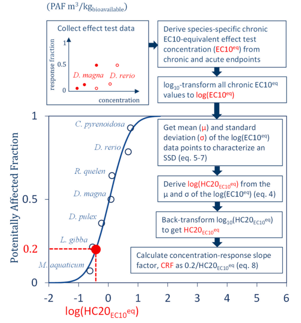

# 📈 Effect Factor

Effect factors (EF) are available from (i) [API](https://api.openchemfacts.com/docs) and (ii) [static files](https://www.data.gouv.fr/users/alban-fournier/) on DataGouv platform.&#x20;

Effect factors are derived from HC20 values (the hazardous concentration that impacts 20% of species in an exposed ecosystem).

## Details

Effect factor (EF), also called concentration-response slope (CRF), represents the increase in the potentially affected fraction of species (PAF) per unit increase in chemical concentration, based on a concentration–response relationship.&#x20;

$$
EF = CRF = 0,2 / HC20
$$


The concentration-response slope factor is derived from taking the slope on the SSD at the HC20. It represents an incremental change in the potentially affected fraction of species due to an incremental exposure to the bioavailable concentration of a chemical at the HC20 level.

The method used to calculate HC20 values is based on latest scientific guidance : "Ecotoxicity characterization of chemicals: Global recommendations and implementation in USEtox" from 2023 accessible [here](https://doi.org/10.1016/j.chemosphere.2022.136807) .&#x20;


Main methodological steps implements for each [database](https://openchemfacts.gitbook.io/openchemfacts-docs/~/revisions/bajplR3tynm1dIIwmeJ4/databases) available on the platform are detailed below.

Source of the schema : Owsianiak et al. 2023, [https://doi.org/10.1016/j.chemosphere.2022.136807](https://doi.org/10.1016/j.chemosphere.2022.136807)

<figure><figcaption></figcaption></figure>

